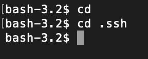
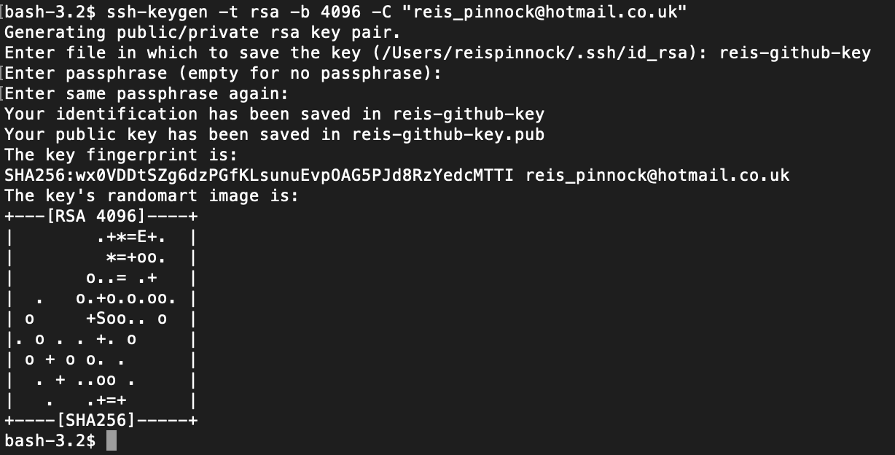
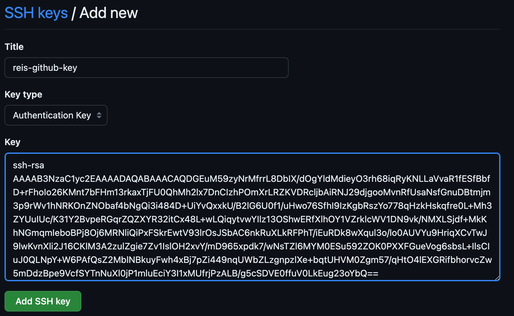
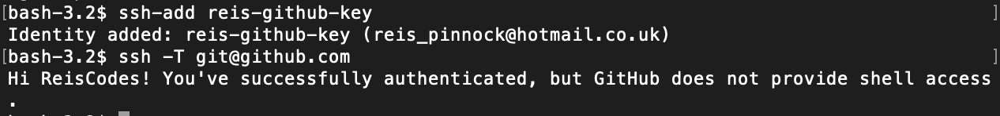
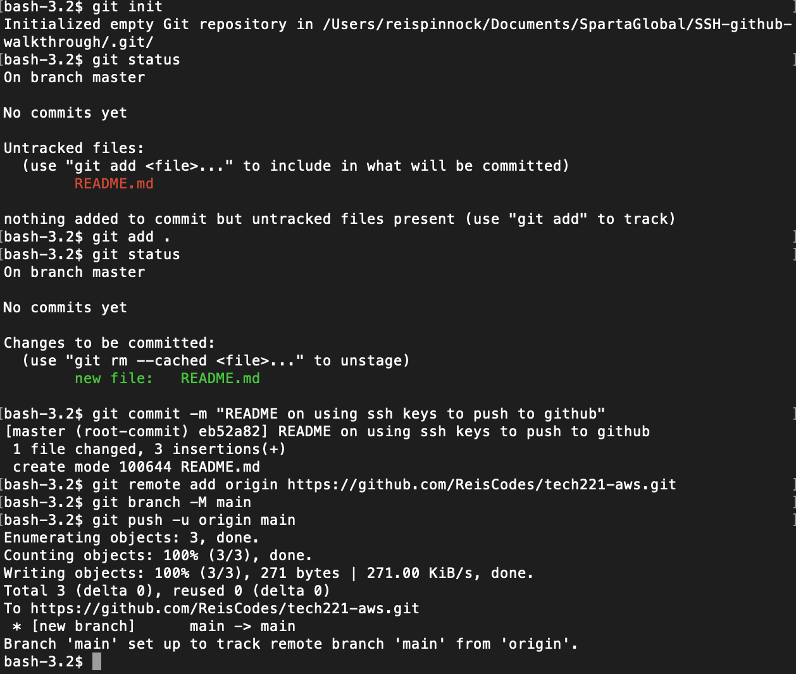

# Using SSH keys with GitHub

### Step 1 - accessing SSH folder and creating private/public keys 
The first thing we need to do when trying to use SSH keys is to create our 
SSH key, to do this we need to open our bash window, and change directory 
to our `.ssh` where we store our keys. 

If you don't have a .ssh folder you can create this by using this command `mkdir .ssh`. 
Now we have our folder we can generate our own SSH keys by typing 
`ssh-keygen -t rsa -b 4096 -C "your_email"` This command will create a key with 
the parameters you have inputted e.g. `-b 4096` determines the length of the 
keys.

Once you have entered the initial command you will be prompted to enter 
the file in which you want to save your keys. This is completely up to you 
but a good naming convention is advised, once entered you will be asked for a 
passphrase. You can leave this and the next prompt empty by just pressing enter 
twice. You will then be shown a message to confirm the creation and a nice 'keys randomart image' as 
shown above.

### Step 2 - Attaching your public key to your GitHub

The next stage is to attach your public SSH key to your GitHub profile. to 
navigate to this page on your GitHub profile: Setting -> SSH & GPG Keys -> New SSH Key.

Now to access your public SSH key, we need to go back to our bash window and use the command
`cat "file name of your SSH key".pub`, this will display the whole key starting with ssh and ending in your 
email, make sure when you enter this into GitHub you only copy the password and no white spaces and then press
add SSH key.

### Step 3 - Adding your private key to git

An agent is a program that keeps your keys in memory so that you only need to unlock them once, 
instead of every time. ssh-agent does this for SSH keys, this runs the agent in background, and sets the 
apropriate environment variables for the current shell instance.

We can see this is confirmed by the `Agent pid 46404` response, we now need to add our private key.

Using the `ssh -T git@github.com` lets us confirm it has been added.

### Step 4 - Pushing files to GitHub using SSH

We firstly need to make a new repository on our GitHub account or refer to a 
previously made one.

Once our keys have been set up, we can create a git repo locally, adding and committing a README to it.
we can then use an SSH connection to push this to our repository on GitHub.

### Extra - Changing back to HTTPS

To change back to HTTPS from SSH, we need to set the url from our local git repository linking to GitHub to 
an HTTPS connection, and we can do this by: 

`git remote set-url origin https:..`

where after HTTPS we put the url of our repository on GitHub. and then changing the git push to https also
as seen below:

`git remote set-url --push origin https://...`

you can now follow the standard procedure of pushing to GitHub but now with an HTTPS connection!
